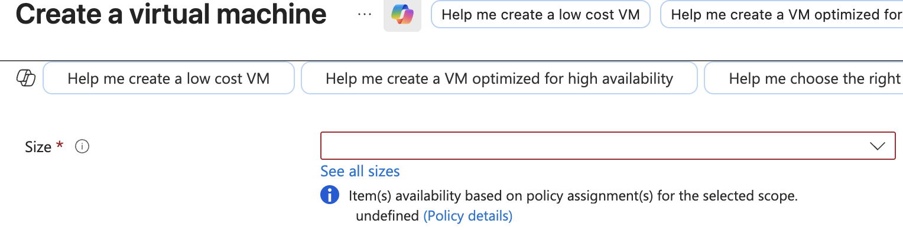

# ☁️ Project 01: Azure Identity & Governance Automation

[](https://azure.microsoft.com/)
[](https://learn.microsoft.com/en-us/powershell/azure/)
[](https://www.json.org/)
[](https://en.wikipedia.org/wiki/Infrastructure_as_code)

## 📌 Project Overview
This project demonstrates a production-ready setup of an Azure environment. It focuses on **Identity Lifecycle Management** and **Automated Governance**. The objective was to replace manual portal configurations with reproducible **PowerShell scripts** and **Policy as Code**.

---

## 🛠️ Technical Stack & Tools
| Category | Tools Used |
| :--- | :--- |
| **Cloud Platform** | Microsoft Azure |
| **Identity Management** | Microsoft Entra ID (Azure AD) |
| **Automation** | Azure PowerShell (Az Module) |
| **Governance** | Azure Policy (JSON Definitions) |
| **Version Control** | Git / GitHub |

---

## 🚀 Phase 1: Identity Automation
I developed the [`create-identities.ps1`](./scripts/create-identities.ps1) script to programmatically provision the **IT-Admins** security group and administrative user accounts.

### 1. Script Execution
The script handles user creation (`New-AzADUser`) and group membership assignment (`Add-AzADGroupMember`) in a single execution flow, reducing manual entry errors.


> *Figure 1: PowerShell output showing the successful creation of the user and group objects.*

### 2. CLI Membership Verification
Using `Get-AzADGroupMember` to programmatically confirm that the **Jacob Admin** identity is correctly nested within the administrative group.


> *Figure 2: Verifying the Object ID and User Principal Name (UPN) are correctly mapped in Entra ID.*

### 3. Portal Validation
Visual verification within the Azure Portal confirming the user status and group membership.


> *Figure 3: Azure Portal view of the 'IT-Admins' group members, confirming the sync was immediate.*

---

## ⚖️ Phase 2: Governance & Cost Control

### 1. Policy as Code: Cost Optimisation
I implemented a comprehensive governance solution using **Infrastructure as Code (IaC)**.

* **Definition:** Authored a [custom JSON definition](./policies/Enforce-Cost-Optimised-VM-Sizes.json) to restrict VM sizes to the **B-Series** family.
* **Automation:** Developed a [PowerShell deployment script](./scripts/deploy-governance.ps1) to programmatically define and assign this policy to the Resource Group, ensuring repeatable enforcement without manual clicking.


> *Figure 4: Execution of the PowerShell script to deploy and assign the cost governance policy.*

### 🔍 Validation: Testing the Guardrails
To verify the guardrails were active, I attempted to provision a high-performance **D-Series** VM, which falls outside the allowed SKU list.

**1. Scope Restriction**
Upon opening the VM size selector, the policy enforcement was immediately visible. The interface indicated that resource selection was being restricted by the `Enforce-Small-VM` assignment.



> *Figure 5: The VM sizing blade showing restrictions on non-compliant SKUs.*

**2. Policy Identification**
The portal explicitly identified the `Enforce-Small-VM` policy assignment as the reason for the restriction, providing immediate feedback to the user.


> *Figure 6: Error details explicitly citing the 'Enforce-Small-VM' policy assignment as the blocker.*

**3. Deployment Block**
As final proof of enforcement, the system prevented the deployment with a **"Blocked by Policy"** status.


> *Figure 7: The "Validation Failed" error message, confirming it is impossible to bypass the control.*

---

### 🔑 Key Observations
* **Proactive Filtering:** The policy filtered the list of available VM sizes *before* selection, improving the user experience by hiding invalid options.
* **Hard Governance:** The system enforced a hard stop with a clear "Blocked by Policy" notification, ensuring strict adherence to the budget.

---

## 🧹 Maintenance & Resource Cleanup

Effective cloud administration includes managing the **lifecycle** of governance rules and identities to prevent "Policy Sprawl" and "Identity Bloat."

### Lifecycle Management (IaC Cleanup)
I developed a cleanup script to revert the environment to its baseline state. This script safely unassigns the policy before deleting the definition, ensuring no "orphan" assignments remain.

* **Script Reference:** [`cleanup-governance.ps1`](./scripts/cleanup-governance.ps1)

```powershell
# Logic for safe governance decommissioning
$RG_Name = "AZ104-Lab"
$PolicyName = "Enforce-Small-VM"

# 1. Remove the Policy Assignment (Releases the 'Lock' on the Resource Group)
Remove-AzPolicyAssignment -Name $PolicyName -Scope (Get-AzResourceGroup -Name $RG_Name).ResourceId -Force

# 2. Remove the Policy Definition (Clean up the library)
Remove-AzPolicyDefinition -Name $PolicyName -Force

# 3. Cleanup Test Identities (Optional)
Remove-AzADGroup -DisplayName "IT-Admins" -Force
