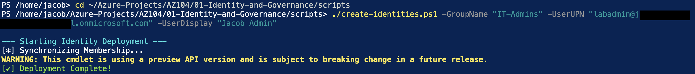
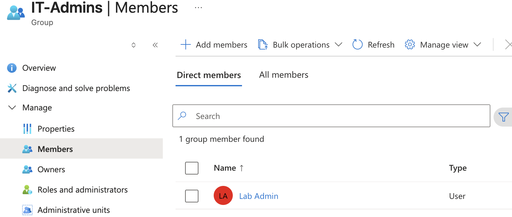

# Project 1: Identity and Governance (AZ-104)

## Overview
This project demonstrates the foundational setup of an Azure environment. It focuses on automating user management and enforcing organizational compliance through **Azure Policy** and **RBAC (Role-Based Access Control)**.

## Project Components

### 1. Identity Automation (`/scripts`) 🟢 **COMPLETE**
* **File:** `create-identities.ps1`
* **Description:** A custom PowerShell script that automates the creation of Microsoft Entra ID users and security groups.
* **Skills Demonstrated:** Azure PowerShell (Az Module), CLI Parameter handling, Identity Lifecycle Management.

### 2. Governance & Compliance (`/policies`) 🟡 **IN PROGRESS**
* **File:** `allowed-vms.json`
* **Description:** A custom Azure Policy definition that restricts the deployment of Virtual Machines to specific SKUs (Standard_B1s, Standard_B2s). 
* **Goal:** Cost management and preventing "shadow IT" from deploying expensive resources.

---

## Implementation Steps
1. **Automated Provisioning:** Executed `create-identities.ps1` to programmatically create the `IT-Admins` security group and the `Jacob Admin` user.
2. **Membership Sync:** Verified that the user was successfully added to the administrative group via the Graph API/Az Module.
3. **Evidence Collection:** Captured CLI and Portal outputs to validate successful deployment.

---

## Success Metrics & Verification

### 1. Script Execution
The script successfully provisioned the administrative identity and verified group existence.

### 2. CLI Membership Verification
Using `Get-AzADGroupMember` to confirm **Jacob Admin** is a member of **IT-Admins**.

### 3. Portal Confirmation
Visual verification within Microsoft Entra ID confirming the new user and group membership.

---

## Upcoming Tasks
- [ ] **Policy Assignment:** Apply `allowed-vms.json` to the subscription scope.
- [ ] **Policy Testing:** Attempt to deploy a `Standard_D8s_v3` VM to verify the denial trigger.
- [ ] **RBAC Verification:** Confirm that users in the "Marketing" group (Reader) cannot delete resources.

---
*This lab is part of my preparation for the AZ-104: Microsoft Azure Administrator certification.*
