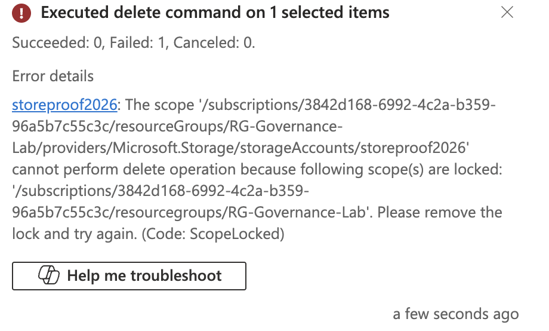
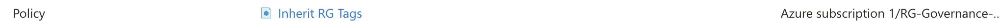
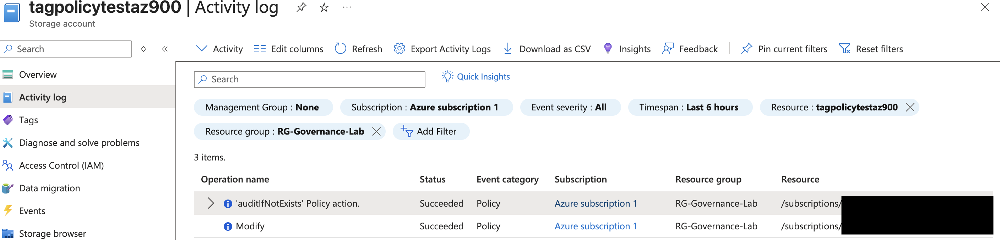
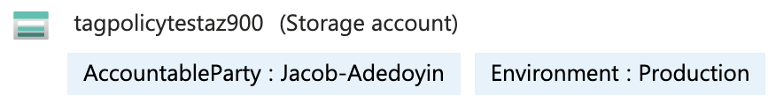

# 🏛️ Project 01:  Azure Governance & Resource Organisation
[](https://azure.microsoft.com/)
[](https://learn.microsoft.com/en-us/azure/governance/)

## 🎯 Project Objective
To demonstrate the ability to organise, secure, and track Azure resources using enterprise governance tools. This project ensures cloud environments remain compliant, cost-accountable, and protected from human error through automated guardrails.

---

## 🛠️ Technical Stack & Tools
| Category | Tools Used |
| :--- | :--- |
| **Cloud Platform** | Microsoft Azure |
| **Management Layer** | Azure Resource Manager (ARM) |
| **Security & Compliance** | Azure Resource Locks, Azure Policy |
| **Governance Tools** | Resource Tagging, Inheritance Logic |

---

## 📸 Phase 1: Resource Tagging & Organization
I implemented a standardised tagging strategy at the Resource Group level. Using key-value pairs, I categorised resources to ensure clear ownership and financial accountability for internal chargebacks.

### 1. Resource Tagging Strategy
* **Environment:** (e.g., Production, Dev, Test) - Distinguishes between resource lifecycles.
* **AccountableParty:** (e.g., Dept Name/Lead) - Identifies the primary contact for maintenance and billing.

<br>


> **Figure 1:** Implementation of the metadata schema on the Resource Group properties blade.

---

## 🔒 Phase 2: Resource Locks & Safety Guardrails
I applied a **'CanNotDelete'** lock to the Resource Group. This serves as a critical safety guardrail, preventing accidental deletion of production assets - a key principle of the **Azure Well-Architected Framework**.

### 2. Validation: Resource Group Level
The system blocks any manual attempt to delete the entire Resource Group container, preserving the project's foundational structure.

<br>


> **Figure 3:** The Azure Portal explicitly blocking a deletion request due to the active lock.

### 4. Validation: Scope Inheritance
To test inheritance, I attempted to delete an individual storage account (`storeproof2026`). The **Azure Resource Manager (ARM)** blocked the request with a `ScopeLocked` error, proving that a parent lock successfully protects all nested child resources automatically.

<br>



> **Figure 4:** Evidence of lock inheritance; the sub-resource is protected by the parent scope lock.

---

## 🤖 Phase 3: Automated Policy Inheritance
To ensure 100% compliance, I deployed a custom **Azure Policy** using the **Modify** effect. This effect actively remediates non-compliant resources by injecting required tags during the deployment phase.

### 5. Policy Assignment
The policy was assigned to the `RG-Governance-Lab` scope, specifically targeting tag inheritance across all resource types to maintain metadata consistency.

<br>


> **Figure 5:** Assignment of the 'Inherit Tag from Resource Group' policy at the lab scope.

### 6. Technical Validation (Activity Log)
The Azure Activity Log confirms the **Modify** action was successfully triggered during the creation of a test storage account. This proves the policy intercepted the request and enforced the organisational tags.

<br>


> **Figure 6:** The Activity Log showing the 'Policy Action' event remediating the resource in real-time.

### 7. Final Remediation Result
Even though tags were omitted during the manual setup of the test resource, the account now carries the inherited metadata required for corporate billing and lifecycle management.

<br>


> **Figure 7:** Successful policy remediation showing tags applied to a resource that was originally deployed without them.

---
## 🧠 Key Cloud Concepts Covered

| Concept | Description |
| :--- | :--- |
| **Resource Groups** | Logical containers for lifecycle management and security boundaries. |
| **ARM Layer** | Applying governance controls via JSON-based definitions at the management plane. |
| **Metadata Management** | Using Tags for cost center allocation and automated resource categorisation. |
| **Inheritance** | Leveraging scope-level locks to protect child resources and simplify administration. |
| **Policy Remediation** | Automating governance at scale using the **Modify** effect to correct non-compliant resources. |

---

## 🧹 Maintenance & Cleanup
To maintain environment hygiene and avoid unnecessary costs, the following decommission steps were performed:

1. **Governance Removal:** The `CanNotDelete` lock was removed and the Azure Policy assignment was deleted to allow for clean resource removal.
2. **Resource Decommissioning:** The entire `RG-Governance-Lab` was deleted, which programmatically terminated all nested storage and networking assets.
3. **Verification:** Confirmed via the Activity Log that all resources were successfully purged.

```powershell
# Final Cleanup Command
Remove-AzResourceGroup -Name "RG-Governance-Lab" -Force
