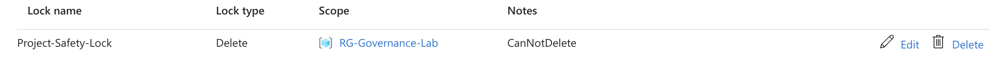
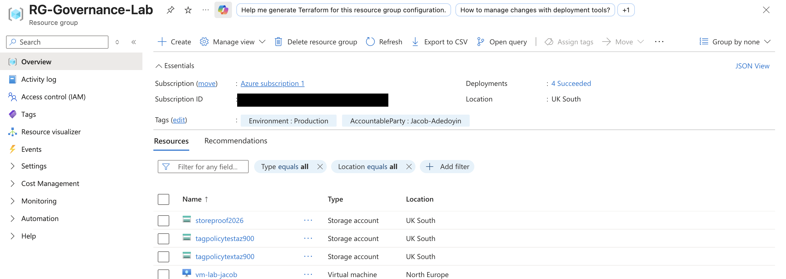

# Project 01: Azure Governance & Resource Organisation

🎯 **Objective** To demonstrate the ability to organise, secure, and track Azure resources using enterprise governance tools.

---

## 📸 Governance Evidence

### 1. Resource Tagging
I implemented a tagging strategy at the Resource Group level to track costs by department and environment. This metadata allows for precise billing and clear resource ownership tracking.

### 2. Resource Locks
I applied a **'CanNotDelete'** lock to the Resource Group. This serves as a critical safety guardrail, preventing the accidental deletion of production assets—a key principle of the Azure Well-Architected Framework.

**Validation Test:** The image below demonstrates the lock in action, showing the system blocking a manual deletion attempt.

### 3. Resource Group Organisation
This view shows the logical grouping of resources within the 'Overview' pane. By expanding the **Essentials** section, we can verify the region (UK South) and the active tags in a single unified view.

---

## 🛠️ Advanced Governance: Automated Inheritance
To ensure 100% compliance, I drafted an **Azure Policy** (see `inherit-tags-policy.json`) that forces resources to inherit the `Environment` and `AccountableParty` tags from their parent Resource Group automatically.

---

## 💡 Key AZ-900 Concepts Covered
* **Resource Groups:** Serving as a logical container for lifecycle management.
* **Azure Resource Manager (ARM):** The underlying service used to apply tags and locks.
* **Tags:** Metadata used for cost center allocation and organization.
* **Locks:** Protecting resources from accidental modification or deletion.
* **Azure Policy:** Implementing automated guardrails at scale.
